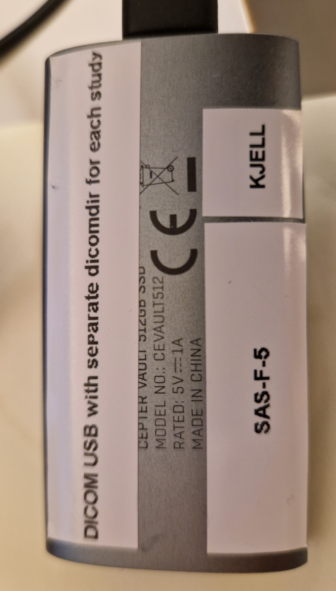
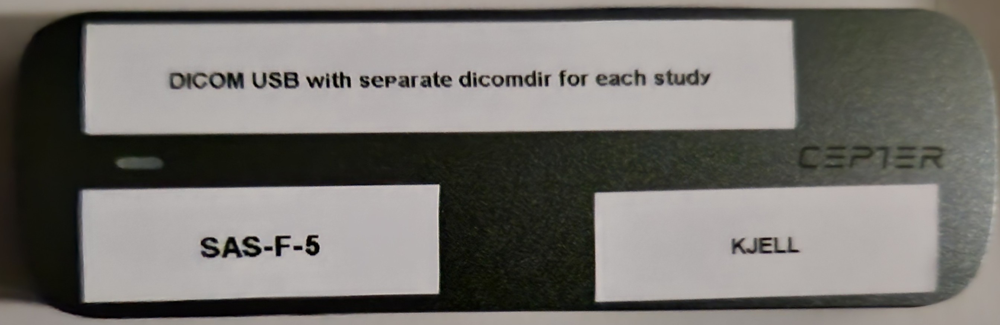

# Project on Blood Speckle Imaging (BSI) at NTNU, Trondheim

## Project Description

This project is part of an echocardiography study where a research cohort woth aortic stenosis patients and healthy controls have been followed over time, with the aim of finding an ultrasound marker for myocardial fibrosis. An echocardiography protocol including High Frane Rate (HFR) ultrasound has been used for this purpose, focusing mainly on the myocardial tissue. Additional high fram rate color doppler echocardiography cine loops with focus on the blood pool (left ventricle and left atrium), and with raw data on IQ level (RF) have been secured in a selection of study participants with adequate acoustic window. This part of the echocardiography study protocol is the basis for the project covered in this repository. Using higher than conventional frame rates for color doppler acquisitions, allows for blood speckle imgaing (BSI).


## Installation

Clone the repository by git clone https://github.com/khoeyland/04_Blood_Speckle_Imaging.git


## Usage - Blood Speckle Imaging echcoardiography protocol

Blood speckle imaging echocardiography loops are acquired at the end of a comprehensive high frame rate echocardiography protocol - on eligible study participants that also could endure some extra 15-20 minutes on the echo bench.

A Scan Assist Pro protocol (GE software) has been used to aid in standardization of echo loop acquisitions during scanning, and to optimize data structure for post processing. With the software Scan Assist Pro Creator, files with extension .uep can be opened in this program, and the echo protool will be shown, as it also will have appeared step by step during the ultrasound scanning of the heart.

Both information on Scan Assist Pro Creator, and the latest version of Scan Assist Pro protocol, are located in the documentation folder in this repository. The BSI part of the echo study protocol starts - in the latest version - from step 165 and goes to the end of the echo protocol (step 199). Se version history of HFR protocol for the stup of older BSI versions that has existed during the inclusion of study participants.

The documentation folder has a subfolder named "archive" where older versions of the Scan Assist Pro protocol used in this poject, are archived. This is for reference, in the rare case it can somehow add structure for the post-processing steps, and for keeping the history of the project. The number of versions reflect technical challanges during the project, and it has mainly affected the part of the protocol that deals with HFR ultrasound on myocardial tissue, and to a lesser extent has it affected the BSI protocol. 

The latest Scan Assist Protocol version (23) has file name 2026-02-24_HFR_protocol_Full.uep , and the main parts are:

Step 1-91:    Clinical part of the echocardiagram
Step 92-158:  2D HFR ultrasound (2D B-mode, TDI, TDI-IQ)
Step 159-164  3D HFR ultrasound (done only in selected cases)
Step 165-196: BSI (apical 4, 2 and 3 chamber + plax. Aqcuisitions are done for LA and LV, and LV alone. Four levels of frame rate are used)

In general, the BSI part of the protocol has been subject to less changes than the HFR part of the protocol.

When arriving at the BSI part of the protocol, I currently shift from prospective to retrospective acquisitions. In the beginning of the study, I did continue prospective cine loop acquisitions also for BSI, as this is required for the data dumps during HFR ultrasound. After the switch from prospective to retrospective, it has been easier to get better quality images, especially for patients with an irregular heart rhythm. 
Further, I turn on RF data, and I deactivate Variance button. In the latest protocol version, I first record data at the frame rate index 0, then intermediate step 1 (around 60 fps), then intermediate step 2 (often somewhere between ~80 and ~120 fps), and finally at the maximal position for frame rate button (often somewhere between 180 and 190 fps). Ocassionaly, I drift apart from the actual steps in the prootocol, but the drift is never big, and I correct this as soon as I discover it.

The BSI protocol is only part of the research protocol, and BSI has been performed in suitable study participants who could endure an extra 15-20 minutes at the end of an otherwise extensive echocardiography protocol. However, there are echo loops in the clinical part of the echo protocol that can be of relevance for BSI. I record ordinary color flow images from the main echo protocol - from all standard views (plax, apical 4, apical 2, and apical 3 chamber). In the documentation folder there is a pdf file with the most recent version of the HFR protocol, and I have marked the steps where the color flow images occur for these standard views (step 3, 29, 52, and 63, respectively). There are also other color flow images from other echo views. The color box has been placed primarily to visualize the integrity of the mitral and aortic valve, and it will not for every case cover the whole of the left ventricle and/or the whole of the left atrium. But at least both the mitral inflow and the LVOT flow have been visualized for all echocardiograms. I have not adjusted the frame rate for these clinical color flow acquisitions, but I have rather accepted the frame rate that comes with the standard research settings on the scanner.

### Version history of BSI protocol

#### 1. Experimental first protocol

Description: Varying color doppler box sector width angle (~ 60, 30, and 15 degrees). With reference to studies done in pediatric cardiology for intraventricular pressure difference (IVPD) assessment of the left ventrivle.
Study IDs: ...


#### 2. Second BSI protocol

Description: Covering the whole LV chamber always with the color doppler box. Acquired two images per view (HQ: frame rate knob at lowest level; HFR: frame rate knob at highest level). Approach of varying the color box sector angle (~ 60, 30, and 15 degrees) was abandoned.
Study IDs: ...


#### 3. Third BSI protocol

Description: Second protocol + added intermediary (medium) high frame rate step in each view: Low FR (HQ), medium FR, and high FR color doppler acquisitons.
Study IDs: ...

#### 4. Fourth BSI protocol

Description: Third protocol + added intermediary (moderate) high frame rate step in each view: Low FR (HQ), medium FR, moderate FR, and high FR color doppler acquisitons.
Study IDs: ...

## Data structure and history after transfer of echo data from the research echo scanner

All echocardiography studies in this research study, have been exported to external hard drive as DICOM USB Harrdisk/Memstick(...). From 14.03.2025 (study ID 23934) 2025, all echo studies have also been exported as USB Harddisk/Memstick(...).

From 12.12.2025 (study ID 28619) and onwards, echocardiography studies have in addition been exported from the scanner in such a way that each study have their own separate dicomdir file, and each of these studies have then been arranged in the following manner:

```
Study-ID 1/
    ├── GEMS_IMG/
    ├── DICOMDIR
Study-ID 2/
    ├── GEMS_IMG/
    ├── DICOMDIR
Study-ID 3/
    ├── GEMS_IMG/
    └── DICOMDIR
```

There are also a few research echo study from before 12.12.2025 that has been exported from the E95 scanner in such a way that a separate dicom dir file was secured for the study. These were echo studies that had still not been deleted from the echo scanner at that point, and a repeat export could then be done. These echo studies are study IDs 2213 (18.11.2025) and 27190 (28.07.2025).

For all the other echo studies in the project that do not have been exported in such a way that a separate dicomdir file for each study was created, Solveig Fadnes helped me on 28.11.2025 to have these echo studies undergo a Python script, in order to be able to separate different components of the echo studies from one another. This Python script did not fully complete, but I understand that most of the studies were dealth with. The output from this Python script was stored on a external hard drive borrowed from Lasse, in a folder named: To Hang Jung

13.01.2026: Echocardiography studies distributed on external hard drive.<br>
Study ID 28619, 30404, 83354, 41830, 49675.<br> 

<br>
<br>
11.03.2026: Echocardiography studies distributed on external hard drive.<br> 
Study ID 94360, 29408, 51844, 600, 97363, 55916, 11360, 127, 52979, 92849, 42379.<br>



## Intitial data exploration

Study_IDs for echcoardiography studies with best quality from initial judgement during scanning and data cleaning: 
30404, 83354, 41820, 49675, 51844, 600, 55916, 127, 52979, 92849, 2213, 77705, 27190, 11360, and 42379.


## Folder tree structure of this repository

```
04_Blood_Speckle_Imaging/
├── .gitignore
├── R/
│   └── 01_read_data.R
├── README.md
├── data/
│   └── 2026-03-11_BSI-and-TDI_SAS-F-5.xlsx
├── documentation/
│   ├── 2026-02-24_HFR-protocol_Full.uep
│   ├── 2026-03-11_Scan-assist-pro_steps-outlined-with-comments.pdf
│   ├── Vivid S70 204 Scan Assist Pro Creator.pdf
│   ├── archive/
│   │   └── 2025-12-12_HFR-protocol_Full.uep
│   └── images/
│       ├── 2026-01-13_Echo-data_SAS-F-5.jpg
│       └── 2026-03-10_Echo-data_SAS-F-5.jpg
├── manuscript/
│   ├── main.tex
│   └── sections/
│       ├── introduction.tex
│       └── methods.tex
└── output/
    ├── figures/
    │   └── fig1.pdf
    └── tables/
        └── table1.tex
```

The documentation/archive folder will contain more files than shown here, but will be left out to keep the file tree short. <br>

## Contribution

I am very grateful for invaluable engineering support from Hang Jung Ling ( @HangJung97 ), Lasse Løvstakken, and Solveig Fadnes in this project.

Pull requests are welcomed. One can open an Issue or use Discussion for issues or discussions regarding the project.


